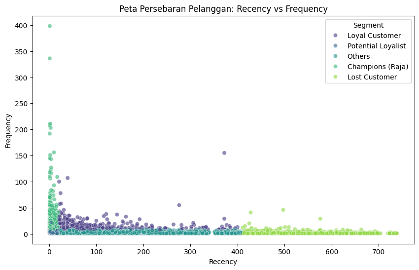

# 🛒 Customer Segmentation Analysis (RFM)

## 📌 Project Overview
This project focuses on analyzing customer purchasing behavior for a UK-based online retailer. Using the **RFM (Recency, Frequency, Monetary)** technique, I segmented customers to identify "Champions", "Loyal Customers", and "At-Risk Customers". 

The goal is to provide **actionable insights** for the marketing team to improve customer retention and optimize campaign budgets.

## 💼 Business Problem
The company was struggling with a "one-size-fits-all" marketing approach, leading to wasted budget and high churn rates. They needed a data-driven way to identify:
1. Who are the most valuable customers?
2. Which customers are about to churn?
3. How to tailor marketing strategies for each group?

## 🛠️ Methodology
I used Python for the end-to-end analysis process:

1. **Data Cleaning:** - Handled 1M+ rows of transaction data.
   - Removed cancelled orders (invoice starting with 'C') and null Customer IDs.
2. **Feature Engineering:** - Calculated **Recency** (days since last purchase), **Frequency** (total transactions), and **Monetary** (total spend) for each customer.
3. **Scoring & Segmentation:** - Applied Quintile Scoring (scale 1-5) to rank customers.
   - Created segments based on RFM scores (e.g., 'Champions', 'Hibernating').

## 📊 Key Insights & Visualizations

### 1. Customer Distribution
The analysis reveals a critical finding: **"Lost Customers"** make up the 2nd largest segment.

*(Note: Ensure the image filename matches what you uploaded)*

### 2. Customer Strategy Map (Recency vs Frequency)
The scatter plot highlights the distinct behavior between loyalists (top-left) and one-time buyers (bottom-right).

*(Note: Ensure the image filename matches what you uploaded)*

## 💡 Business Recommendations

Based on the analysis, here are the strategic recommendations:

| Customer Segment | Strategy | Action Plan |
| :--- | :--- | :--- |
| **Champions** 🏆 | Retention | Provide VIP access to new products. Do not offer discounts (they are not price-sensitive). |
| **Loyal Customers** 🤝 | Up-Selling | Recommend higher-value items or bundles to increase basket size. |
| **At Risk** ⚠️ | Win-Back | **URGENT:** Send personalized "We Miss You" emails with limited-time offers. |
| **Lost Customers** 💤 | Reactivation | Low-cost automated campaigns. Do not overspend on ads for this group. |

## 📂 File Structure
- `Customer_Segmentation_RFM.ipynb`: The complete Python notebook containing code and analysis.
- `rfm_distribution.png`: Visualization of segment counts.
- `rfm_scatterplot.png`: Visualization of Recency vs Frequency.

---
*If you find this project useful, feel free to connect with me on LinkedIn!*
