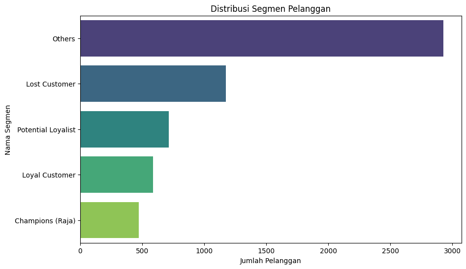

# 🛒 Customer Segmentation & Churn Analysis (RFM)

## 📌 Executive Summary

This project analyzes over 1 million transaction records from a UK-based online retailer using **Python** and **RFM Analysis**. 

The goal was not just to group customers, but to diagnose the health of the business. The analysis uncovered a critical finding: **A massive portion of the customer base has churned (stopped buying), signaling an urgent need for a retention strategy.**

## 💼 The Challenge
The marketing team was using a "spray and pray" approach—sending the same promotions to everyone. This resulted in:
1.  Wasted marketing budget on inactive users.
2.  Missed opportunities to upsell loyal customers.
3.  Inability to spot customers who are about to leave.

## 🛠️ Methodology
I performed a complete data analysis pipeline:
1.  **Data Cleaning:** Handled missing values (`Customer ID`) and removed cancelled transactions (`Invoice 'C'`) to ensure data integrity.
2.  **RFM Modeling:** Calculated Recency, Frequency, and Monetary values for every unique customer.
3.  **Customer Segmentation:** Used Quintile Scoring (1-5 scale) to classify customers into behavioral segments.

## 📊 Key Findings & Visualizations

### 1. The "Churn" Warning Signal

**Insight from data:**
As seen in the chart above, the segments are ranked by population:
1.  **Others:** Average customers (The general mass).
2.  **Lost Customers:** 🚨 **The 2nd largest group.** This indicates a "Leaky Bucket" problem—the business acquires customers but fails to keep them engaged.
3.  **Potential Loyalists:** A promising group that needs nurturing.
4.  **Champions:** The smallest, most exclusive group driving high revenue.

### 2. Customer Behavior Map (Recency vs Frequency)

The scatter plot confirms the split:
- A dense cluster at the **bottom-right** (High Recency, Low Frequency) represents the **Lost Customers**.
- A valuable but small cluster at the **top-left** represents the **Champions**.

## 💡 Strategic Recommendations
Based on the high volume of "Lost Customers", here is my proposed action plan for the marketing team:

| Priority | Segment | Strategy | Actionable Tactic |
| :--- | :--- | :--- | :--- |
| **URGENT** | **Lost Customers** | **Win-Back** | Do not span them. Send a specific "We Miss You" email with a high-value incentive (e.g., Free Shipping) to reactivate them. |
| **High** | **Champions** | **Retention** | Create a VIP Club. Offer early access to new products instead of discounts to maintain profit margins. |
| **Medium** | **Potential Loyalists** | **Upsell** | Use "Nudge Marketing". Offer a discount on the *second* purchase to turn them into habitual buyers. |

## 📂 Project Structure
- `Customer_Segmentation.ipynb`: Python code for Data Cleaning, RFM Calculation, and Visualization.
- `distribusi_segmen_pelanggan.png`: Bar chart showing segment counts.
- `online_retail_II.csv`: Dataset used (Source: Kaggle Repository).

